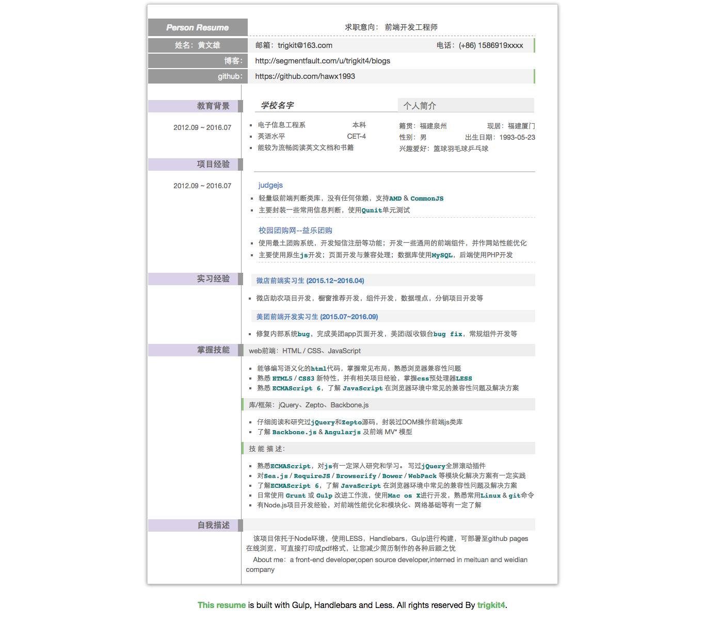

## About this repo

<a target='_blank' rel='nofollow' href='https://app.codesponsor.io/link/gWs9P5H4YpntyAR6x1qG5EkX/hawx1993/resume-master'>
  
</a>

`resume-master` 是一个简历生成器，从json中读取数据，可部署到`github pages` 在线浏览，也可生成pdf格式简历。http://hawx1993.github.io/resume-master/

 - 简历数据存放在`resume.json`文件中
 - 简历中的代码可高亮
 - 有任何问题欢迎提issue

#### 简历效果如下图所示



## 环境安装

首先确保你的电脑已经安装了
Node.js：https://nodejs.org/en/，

然后在终端输入如下命令安装gulp和bower：

```js
$ npm install --global gulp
$ npm install -g bower
```

## Build

 1.执行 `npm install` 安装依赖

 2.执行 `bower install`安装所需库

 3.填写你的个人信息于`resume.json`文件

 4.执行 `gulp dev`来构建项目

## 生成PDF文件

请使用chrome或者Safari浏览器来打印。

Mac chrome执行：文件 —— 打印,即可（Windows系统直接鼠标右键——打印）

Safari执行：文件——导出为PDF 即可

或者点击下方的`print it`打印
## deploy to github pages

1.clone this repo

2.修改`package.json`文件的SSH git remote orgin为你的SSH 地址（你需要创建一个新的仓库）

3.创建`gh-pages`分支

4.终端执行`gulp deploy` 稍等片刻即可部署完毕

5.到你的`github pages`站点访问（url后面加上`/resume-master`即可访问）

## LICENSE

 (MIT License)

 Copyright (c) 2016 trigkit4
